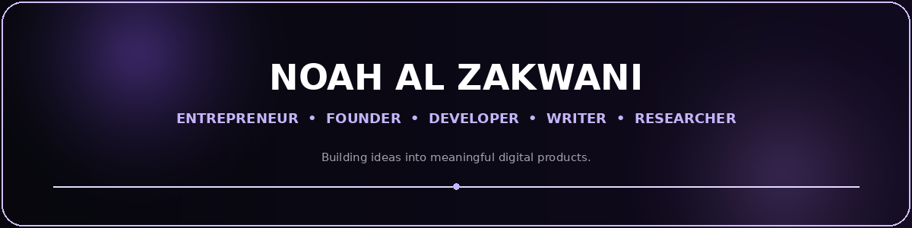
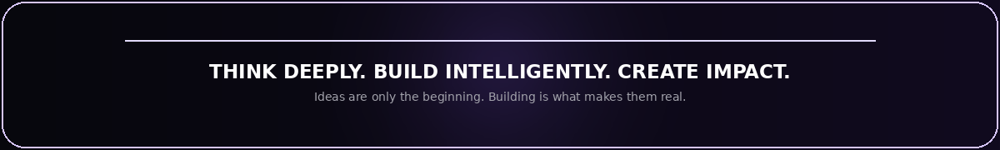

  

&nbsp;

&nbsp;

&nbsp;

---

# 🧠 About Me

I'm an **Entrepreneur, Founder, Developer, Writer, and Researcher** focused on building innovative digital products at the intersection of **technology, entrepreneurship, education, and investment**.

I turn ideas into real-world projects through **strategy, design, development, and execution**.

> **Think deeply. Build intelligently. Create impact.**

---

## 🚀 What I Do

<table>
<tr>

<td align="center" width="33%">

### 💡 Entrepreneurship

Innovation  
Business Strategy  
Product Development  
Digital Ventures

</td>

<td align="center" width="33%">

### 💻 Technology

Web Development  
Digital Platforms  
Applications  
Software Solutions

</td>

<td align="center" width="33%">

### 🎨 Design & Product

UI/UX  
Product Design  
Branding  
Digital Experiences

</td>

</tr>
</table>

---

## 🔭 Currently Building

# 🧠 Lamat Fikr — لمة فكر

A cultural and educational community platform connecting **creators, entrepreneurs, learners, and communities** through content, communities, products, conversations, and digital services.

**Community • Content • Education • Products • Digital Services**

---

## 🛠️ Tech Stack

### Languages

### Frameworks

### Tools & Platforms

---

## 📊 GitHub Analytics

  

---

## 🌐 Connect With Me

  

  

